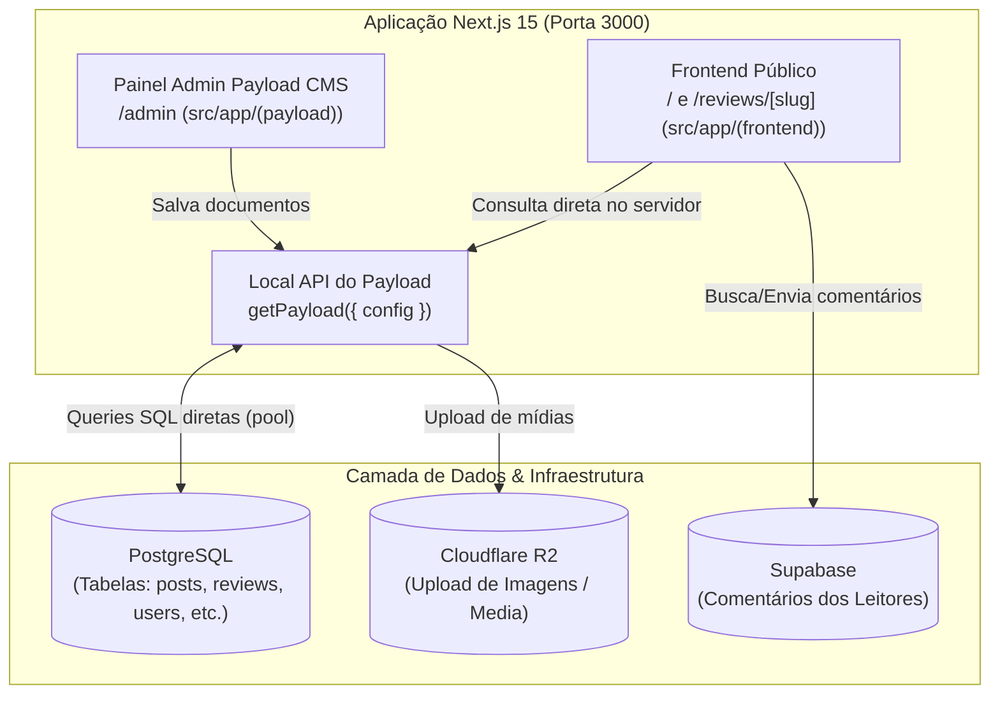
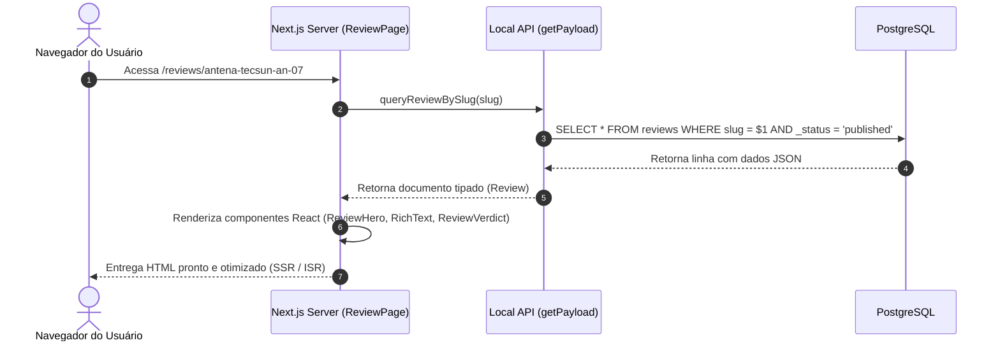
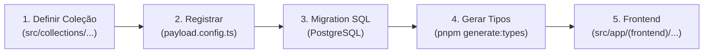

# 🏛️ Guia de Arquitetura: Payload CMS 3.x, Banco de Dados e Frontend

> Documento explicativo sobre o funcionamento interno do projeto **Portal Lineup**, detalhando a relação entre o **Painel Administrativo (Payload CMS)**, o **Banco de Dados (PostgreSQL)** e o **Frontend Público (Next.js App Router)**.

---

## 📑 Sumário

1. [Visão Geral da Arquitetura Unificada](#1-visão-geral-da-arquitetura-unificada)
2. [O Painel Admin: O que é Nativo vs Customizado](#2-o-painel-admin-o-que-é-nativo-vs-customizado)
3. [Armazenamento e Banco de Dados: A Regra do `push: false` e Migrations](#3-armazenamento-e-banco-de-dados-a-regra-do-push-false-e-migrations)
4. [Como o Frontend Recupera os Dados Criados](#4-como-o-frontend-recupera-os-dados-criados)
5. [Paralelo Prático: Criando uma Nova Coleção (`Reviews2` / `Podcasts`)](#5-paralelo-prático-criando-uma-nova-coleção-reviews2--podcasts)
6. [Customização do Painel Admin para Usuários Leigos](#6-customização-do-painel-admin-para-usuários-leigos)

---

## 1. Visão Geral da Arquitetura Unificada

Uma dúvida comum em projetos com CMS é imaginar que existem dois servidores separados (um servidor Node para o CMS e outro para o site). **Neste projeto, tudo roda em um único processo Next.js 15.**



### Pontos-Chave:
1. **Frontend e Admin Coexistem:** Ao executar `pnpm dev`, o Next.js serve tanto a interface pública (`/`) quanto o painel administrativo (`/admin`).
2. **Sem Latência de API HTTP:** Quando o frontend precisa de um review, ele **não faz uma chamada HTTP externa** (ex: `fetch('https://api.../reviews')`). Ele usa a **Local API** do Payload, executando uma query SQL direta no PostgreSQL a partir do servidor do Next.js.

---

## 2. O Painel Admin: O que é Nativo vs Customizado

Na tela de listagem de **Reviews** do painel administrativo, há uma divisão clara entre os recursos que o Payload fornece prontos e o que foi implementado sob medida:

| Recurso Visual / Funcional | Origem | Descrição |
| :--- | :--- | :--- |
| **Menu Lateral (Coleções e Globais)** | **Nativo** | Gerado automaticamente a partir do array `collections` e `globals` em [src/payload.config.ts](file:///home/flavio/Projetos/portal-lineup/src/payload.config.ts). |
| **Barra de Pesquisa com Filtros** | **Nativo** | Campo de busca por texto com *debounce*, filtros condicionais e seleção de colunas visíveis. |
| **Botão "Criar Novo" e Formulário** | **Nativo** | Cria a interface de edição automaticamente com base nos tipos de campos definidos. |
| **Paginação e Ordenação** | **Nativo** | Controle de 10, 25, 50 itens por página e ordenação por colunas (`createdAt`, `rating`, `title`). |
| **Autenticação e Sessão** | **Nativo** | Sistema de login seguro com tokens JWT e expiração controlada. |
| **Sistema de Rascunhos (Drafts)** | **Nativo** | Permite salvar como rascunho ou publicar, mantendo histórico de versões (`_reviews_v`). |
| **APIs REST e GraphQL** | **Nativo** | Endpoints como `/api/reviews` e `/api/graphql` criados sem necessidade de codificação extra. |
| **Campos de Produto e Avaliação** | **Customizado** | O grupo `product` (marca, foto), `offers` (preço, link afiliado) e `rating` definidos em [src/collections/Reviews/index.ts](file:///home/flavio/Projetos/portal-lineup/src/collections/Reviews/index.ts). |
| **Lista de Prós e Contras** | **Customizado** | Campos do tipo `array` estruturados para receber pontos positivos e negativos. |

---

## 3. Armazenamento e Banco de Dados: A Regra do `push: false` e Migrations

### Onde os dados são armazenados?
Todos os dados das matérias, reviews, usuários, configurações de cabeçalho/rodapé e links ficam persistidos no **PostgreSQL** (configurado via `POSTGRES_URL`). As imagens físicas ficam armazenadas no bucket **Cloudflare R2** (armazenamento compatível com S3).

### A Regra de Ouro: `push: false`
No arquivo [src/payload.config.ts](file:///home/flavio/Projetos/portal-lineup/src/payload.config.ts), o banco de dados está configurado assim:

```typescript
db: vercelPostgresAdapter({
  pool: {
    connectionString: process.env.POSTGRES_URL || '',
  },
  push: false, // ⚠️ ATENÇÃO MÁXIMA
}),
```

* **`push: true` (comportamento de desenvolvimento rápido):** O Payload tenta sincronizar e alterar o banco de dados automaticamente ao inicializar.
* **`push: false` (o padrão seguro deste projeto):** O Payload **NUNCA** altera a estrutura das tabelas sozinho. Isso protege os dados de produção contra exclusões acidentais de colunas.

### É necessária uma nova migration ao criar coleções ou campos?
> [!IMPORTANT]
> **SIM, é obrigatória uma migration ou execução de script SQL!**

* Se você criar uma nova coleção (ex: `review2`) apenas no TypeScript e tentar salvar um registro pelo painel admin, o PostgreSQL disparará um erro informando que a tabela não existe (`relation "review2" does not exist`).
* Para a coleção `Reviews`, foi utilizado o script [scripts/001-create-reviews-tables.sql](file:///home/flavio/Projetos/portal-lineup/scripts/001-create-reviews-tables.sql), que criou:
  1. A tabela principal: `"reviews"`
  2. A tabela de versionamento/rascunhos: `"_reviews_v"`
  3. Tabelas auxiliares para arrays: `"_reviews_pros"`, `"_reviews_cons"`, etc.
  4. Tipos enumerados (Enums) para disponibilidade e status.

---

## 4. Como o Frontend Recupera os Dados Criados

O fluxo de recuperação de dados acontece de ponta a ponta sem intermediários HTTP. Veja como a página [src/app/(frontend)/reviews/[slug]/page.tsx](file:///home/flavio/Projetos/portal-lineup/src/app/(frontend)/reviews/[slug]/page.tsx) opera:



### O Código no Frontend:

```typescript
// 1. Inicializa o Payload em memória
const payload = await getPayload({ config: configPromise })

// 2. Consulta o banco com tipagem e filtros seguros
const result = await payload.find({
  collection: 'reviews',
  draft: false,          // Apenas matérias publicadas (a menos que esteja no modo Preview)
  limit: 1,
  overrideAccess: false, // Respeita regras de permissão
  where: {
    slug: { equals: slug },
  },
})

const review = result.docs?.[0]
```

### O que acontece com os tipos TypeScript?
Ao rodar `pnpm generate:types`, o Payload analisa todas as coleções e escreve o arquivo [src/payload-types.ts](file:///home/flavio/Projetos/portal-lineup/src/payload-types.ts). Graças a isso, dentro do React o desenvolvedor tem auto-complete total:
* `review.product?.name`
* `review.rating`
* `review.offers?.price`

---

## 5. Paralelo Prático: Criando uma Nova Coleção (`Reviews2` / `Podcasts`)

Se no futuro for necessário criar uma nova entidade independente (por exemplo, `Podcasts` ou uma variação `Reviews2`), o fluxo segue 5 etapas bem definidas:



1. **Definição da Coleção:**  
   Criar o arquivo `src/collections/Podcasts/index.ts` contendo a lista de campos (`title`, `audioUrl`, `episodeNumber`, etc.).
2. **Registro no Config Geral:**  
   Importar e incluir no array `collections: [...]` de [src/payload.config.ts](file:///home/flavio/Projetos/portal-lineup/src/payload.config.ts).  
   *Neste instante, o Payload já sabe desenhar a interface administrativa.*
3. **Criação da Tabela no Banco (Migration):**  
   Executar o script SQL no PostgreSQL criando a tabela correspondente (`CREATE TABLE "podcasts" (...)`), pois o projeto opera com `push: false`.
4. **Atualização de Tipos:**  
   Executar no terminal:
   ```bash
   pnpm generate:types
   ```
5. **Criação da Rota no Frontend:**  
   Criar a pasta `src/app/(frontend)/podcasts/[slug]/page.tsx` usando `payload.find({ collection: 'podcasts', ... })` para renderizar a página aos visitantes.

---

## 6. Customização do Painel Admin para Usuários Leigos

O Payload CMS permite simplificar e personalizar a interface de gerenciamento para que redatores, editores ou clientes sem conhecimento técnico operem sem dificuldades.

### Estratégias Declarativas (Sem código React complexo):

1. **Textos Explicativos e Dicas (`admin.description`):**  
   Adicionar orientações em linguagem simples abaixo de cada campo:
   ```typescript
   {
     name: 'rating',
     type: 'number',
     label: 'Nota Geral',
     admin: {
       description: 'Digite uma nota de 1.0 a 5.0 (Exemplo: 4.5)',
       step: 0.1,
     },
   }
   ```

2. **Organização em Abas (`tabs`):**  
   Separar formulários longos em abas amigáveis (ex: *"Conteúdo Principal"*, *"Imagens"*, *"Configurações de SEO"*), evitando poluição visual.

3. **Campos Condicionais (`admin.condition`):**  
   Ocultar campos irrelevantes até que uma opção seja marcada.  
   *Exemplo:* O campo "Preço da Oferta" e "Link de Afiliado" só ficam visíveis se o redator marcar a opção *"Incluir Oferta de Compra"*.

4. **Ocultar Menus Desnecessários (`admin.hidden: true`):**  
   Coleções puramente técnicas (como `Redirects`, `Search Results` ou `Pages` institucionais) podem ser ocultadas do menu lateral para não confundir o usuário comum:
   ```typescript
   admin: {
     hidden: ({ user }) => !user?.roles?.includes('admin'),
   }
   ```

5. **Barra Lateral Dedicada (`admin.position: 'sidebar'`):**  
   Campos rápidos como Status, Categoria, Autor e Data de Publicação podem ser movidos para a coluna direita da tela de edição.

### Estratégias Avançadas (Com Componentes React):

* **Componentes de Campo Sob Medida:** Substituir o campo numérico de nota por um componente de **estrelas clicáveis** ou seletores visuais coloridos.
* **Dashboard Personalizado (`admin.components.beforeDashboard`):** Criar uma página inicial com cards de boas-vindas, vídeos de treinamento ou botões diretos de atalho (ex: *"Escrever Nova Notícia"*, *"Publicar Novo Review"*).
* **Live Preview:** O projeto já possui suporte a pré-visualização em tempo real ([LivePreviewListener](file:///home/flavio/Projetos/portal-lineup/src/components/LivePreviewListener)), permitindo que o redator veja como a matéria ficará no celular, tablet ou computador enquanto digita, antes de publicar.
